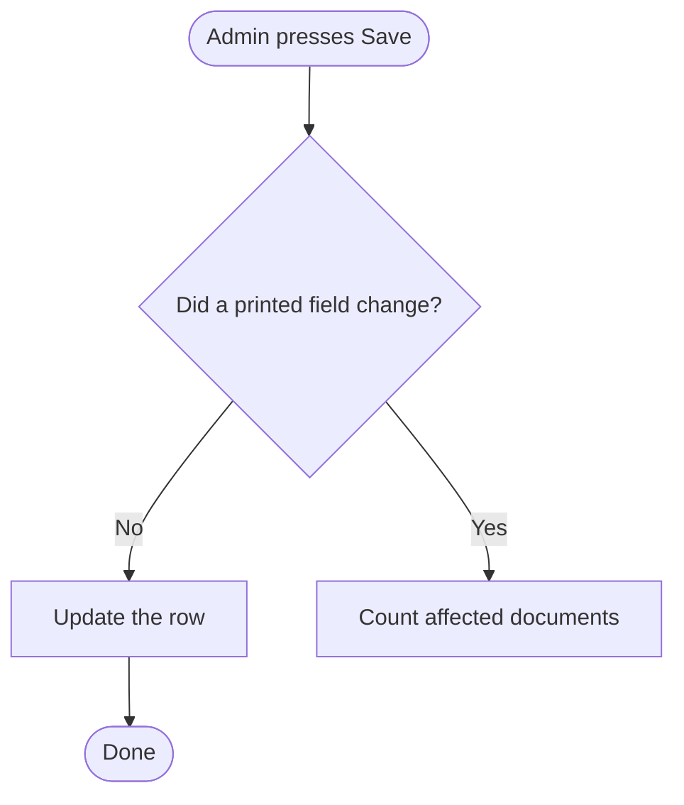

# Flowchart diagrams

## Why this skill exists

The default failure is not an ugly diagram. It is a diagram that **looks** like a flowchart — boxes, arrows, one diamond, a green oval at the top — but has no grammar underneath. Everything is a rectangle, branch arrows are unlabelled, explanations are stuffed inside nodes, and real decisions (permission gates, cancel paths, error paths) sit in sticky notes or in nothing at all. It reads fine to the person who just wrote it and is useless to anyone else, because none of the visual choices carry meaning.

A flowchart is a small formal language. Shape = kind of step. Arrow = "and then". Diamond = a question whose exits are named and mutually exclusive. If a diagram uses those consistently, a reader can follow a path with their finger without reading every word. That is the entire point, and it is what to protect.

## Step 1 — Check it is actually a flowchart

Before drawing anything, name what the content is. Forcing the wrong content into a flowchart is a bigger failure than bad shapes.

| The content is…                                   | Use                                                                  |
| ------------------------------------------------- | -------------------------------------------------------------------- |
| An ordered process with branches, over time       | **Flowchart** — this skill                                           |
| Two or more options compared on the same criteria | A comparison table or side-by-side panels                            |
| Before/after states of the same data              | Two labelled panels with one arrow between them                      |
| Which pieces exist and what talks to what         | Architecture / component diagram, no start or end node               |
| Definitions of terms                              | A glossary panel — put it on its **own page**, never beside the flow |
| Who does what over time across actors             | A sequence diagram, or a flowchart with swimlanes                    |

Mixed content is normal. In a .drawio file, give each kind its own `<diagram>` page rather than crowding one canvas. A glossary sitting next to a flow steals attention from it and is the most common way a good flow gets buried.

If the user did not say which type they wanted, decide from the content and say in one line which you chose and why. Do not ask first when the content clearly implies one.

## Step 2 — Write the node list before touching XML

Write a plain list first, one line per node, each tagged with its shape and its actor:

```
[terminator][browser] Admin presses Save
[decision]  [browser] Did a printed field change?  -> yes | no
[process]   [server]  Count documents using the old versions
[data]      [db]      read employee_history
[io]        [browser] Dialog: which kind of change is this?
[decision]  [browser] Which answer?  -> fix | record | cancel
```

Doing this first is what catches structural problems while they are still cheap to fix. Two things to look for as you write it:

**Any node whose text needs the word "and" or a second sentence is two nodes.** A node holds one action. "Show the dialog and save the answer" is a display step followed by a write step.

**Any node with more than one outgoing arrow must be a decision.** If a process box branches, the question that decided the branch is missing. Add it.

## Step 3 — Hunt the branches the prose forgot

Prose descriptions describe the happy path. Diagrams expose the gaps, which is most of their value. Walk this list explicitly and add whatever is real:

- **Cancel / dismiss** — every dialog or confirmation has one. Where does it land?
- **Permission or role gate** — does some class of user reach this step and get refused, or see a disabled option?
- **Validation failure** — what happens on bad input, before any write?
- **Empty or zero case** — the "0 records affected" branch often needs different wording, not a different path.
- **Failure of the write itself** — transaction rollback, network error. Include it if the design has an answer; if it does not, that absence is itself worth reporting to the user.
- **Already-in-that-state** — nothing actually changed; does it still write?

Anything found here that the source material did not mention goes to the user as a question, not into the diagram as an invention.

## Step 4 — Shape grammar

Use these and only these. Consistency is what makes shapes readable; a sixth shape type invented for one node teaches the reader nothing.

| Meaning                              | Shape                  | drawio style                                                                                                                               |
| ------------------------------------ | ---------------------- | ------------------------------------------------------------------------------------------------------------------------------------------ |
| Start / end                          | Stadium (rounded ends) | `rounded=1;whiteSpace=wrap;html=1;arcSize=40;fillColor=#d5e8d4;strokeColor=#82b366;`                                                       |
| A step the system performs           | Rectangle              | `rounded=0;whiteSpace=wrap;html=1;fillColor=#dae8fc;strokeColor=#6c8ebf;`                                                                  |
| A question                           | Diamond                | `rhombus;whiteSpace=wrap;html=1;fillColor=#ffe6cc;strokeColor=#d79b00;`                                                                    |
| Something a person sees or answers   | Parallelogram          | `shape=parallelogram;perimeter=parallelogramPerimeter;whiteSpace=wrap;html=1;fixedSize=1;size=20;fillColor=#e1d5e7;strokeColor=#9673a6;`   |
| A table (one table, one touch point) | Cylinder               | `shape=cylinder3;whiteSpace=wrap;html=1;boundedLbl=1;backgroundOutline=1;size=15;fillColor=#f5f5f5;strokeColor=#666666;`                   |
| Why, not what                        | Sticky note            | `shape=note;whiteSpace=wrap;html=1;size=14;fillColor=#fff2cc;strokeColor=#d6b656;align=left;spacingLeft=8;verticalAlign=top;spacingTop=6;` |

Rules that follow from the table:

- **Every exit from a diamond carries a label** (`Yes`, `No`, `Cancel`, `Fix a mistake`). An unlabelled branch forces the reader to infer the condition from the destination box, which defeats the diamond.
- **Exits are mutually exclusive and cover every case.** Two exits from a yes/no question, three from a three-way answer, and no gaps.
- **The diamond holds the question, never the answer.** `Which answer did the admin give?` in the diamond; `Fix a mistake` on the arrow.
- **Nodes say what happens; notes say why.** If node text contains "Meaning:", "This is because", "Note that", or an italic aside, that sentence belongs in a note attached with a dashed connector (`dashed=1;endArrow=none;`). Node text works best at roughly 12 words or fewer.
- **A cylinder names a table; the arrow names the operation.** This has its own section below, because it is the easiest rule to get half-right.
- **Add a legend** — one line near the title stating what each shape means. It costs nothing and makes the grammar self-teaching for a reader who does not know it.

## Step 4b — Saying what actually happens to a table

`writes` is not an operation. A reader looking at an arrow labelled `writes` pointing at a cylinder labelled `employee — one row updated` still cannot tell whether a row was created or an existing one changed, and that difference is usually the whole point of the step. Reads escape this because a read has only one meaning; writes do not.

Split it the same way the rest of the grammar splits things — **the shape is a noun, the arrow is a verb**:

|          | Holds                                                                         | Example                                                         |
| -------- | ----------------------------------------------------------------------------- | --------------------------------------------------------------- |
| Cylinder | The table name, and nothing else. A short qualifier for _which_ rows is fine. | `employee_history`<br>`employee_history — rows for this person` |
| Arrow    | One word: `SELECT` / `INSERT` / `UPDATE` / `DELETE` / `UPSERT`.               | `UPDATE`<br>`INSERT`                                            |

So `employee` ← `UPDATE`, not `employee, one row updated` ← `writes`.

**Keep the arrow to the bare verb.** Row counts and conditions on the arrow (`UPDATE 2 rows`, `INSERT 1 row per field changed`) look precise but crowd the busiest part of the canvas, go stale the moment the design shifts, and repeat what the surrounding boxes already imply. If _which_ rows genuinely matters to the reader, it is a property of the data, so put it in the cylinder as a qualifier — `employee_history — every version holding the old value` — or in a note. The arrow answers one question only: what kind of write is this?

**One cylinder = one table, one operation, one point in the flow.** Three consequences worth being deliberate about:

- **Never name two tables in one cylinder.** `employee and employee_history` forces one arrow to describe two different writes, and the reader cannot tell which is which. Draw two cylinders, one arrow each.
- **Never mix a read and a write on one cylinder.** They happen at different moments, and arrow direction is too weak a signal to carry the difference. Give each its own cylinder at its own point in the flow.
- **The same table touched twice is two cylinders.** Reading `employee_history` to count, then writing it after the person answers, are two separate events; collapsing them into one shape hides the gap between them, which is often exactly where the interesting behaviour lives.

This costs a few extra shapes and buys a diagram where someone can answer "what does this actually do to the database" without opening the code.

## Step 5 — Lanes, when a boundary matters

Use swimlanes when steps cross a boundary the reader needs to see: browser / server / database, or clerk / approver / system. Lanes turn an invisible fact into a visible one — for example, that a flow crosses into the server twice, once to read and once to write, which no amount of prose inside boxes can show as clearly.

Skip lanes when everything happens in one place. They cost width and add nothing there.

Layout convention: one lane per actor, flow moving top to bottom, lanes ordered by the sequence in which they first act.

## Step 6 — Build the .drawio file

Start from `assets/swimlane-template.drawio` — it is a working three-lane skeleton with correct styles, a legend, labelled exits, and a note, sized so nothing overlaps. Read `references/drawio-xml.md` for the geometry rules that are easy to get wrong: lane-relative child coordinates, keeping edges parented to the root, reserving a routing channel so a merge arrow does not cut through a box, and the vertical grid to lay nodes on.

Geometry hygiene matters more than it sounds, because a diagram whose arrows cross through boxes reads as careless and undermines trust in the content. The template's spacing is chosen so this does not happen.

## Step 7 — Validate before handing it over

Run the checker on the finished file:

```bash
python3 scripts/check_flowchart.py path/to/diagram.drawio
```

It reports unlabelled decision exits, processes that branch without a decision, orphaned and dead-end nodes, prose crammed into nodes, overlapping geometry, broken edge references, and pages where a single shape type dominates. Fix what it finds, or tell the user why a finding is intentional. It is a linter, not a judge — a deliberate second terminator is fine, a silently unlabelled branch is not.

Then read the diagram once as a stranger would: pick one path, follow it end to end, and check you never need to read a note to know where to go next.

## Mermaid instead of drawio

When the diagram belongs in a README, a code comment, or a chat reply, Mermaid is the better output — same grammar, less ceremony:



`([text])` is a terminator, `[text]` a process, `{text}` a decision, `[/text/]` input/output, `[(text)]` a datastore, and `subgraph` gives lanes. Everything in steps 1–5 applies unchanged; only step 6's geometry work disappears. Reach for drawio when the user needs to edit it by hand or when the diagram is large enough that manual layout beats auto-layout.

## Reference files

- `assets/swimlane-template.drawio` — working skeleton to copy and rename
- `references/drawio-xml.md` — geometry, lane coordinates, edge routing, page structure
- `scripts/check_flowchart.py` — the validator
